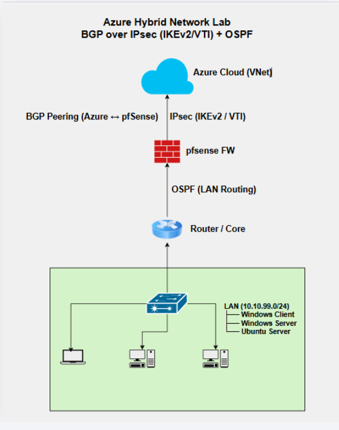

# 🚀 Azure Hybrid Lab (BGP + IPsec + OSPF)

This project demonstrates a hybrid cloud setup connecting an on-premises network to Azure using:

* IPsec (IKEv2 / VTI)
* BGP (Azure ↔ pfSense)
* OSPF (pfSense ↔ LAN)

---

## 🏗️ Architecture

---

## 🧠 Routing Design

* **BGP** → Azure ↔ pfSense
* **OSPF** → pfSense ↔ LAN
* Hybrid routing model (cloud + internal)

---

## ❌ Problem

* No connectivity between Azure and LAN
* ICMP failing
* RDP timeout

---

## 🔍 Troubleshooting

tcpdump revealed:

* Traffic entering IPsec tunnel
* No return traffic

---

## 💥 Root Cause

Missing return route on LAN side.

---

## 🛠️ Fix

Added static route:

10.100.0.0/16 → 10.10.99.1

---

## ✅ Result

* Full connectivity restored
* ICMP working
* End-to-end communication successful

---

## 📸 Screenshots

| Step    | Description                     |
| ------- | ------------------------------- |
| Problem |  |
| Debug   |  |
| Fix     |      |
| Success |  |

---

## 📂 Configurations

See `/configs` folder for:

* pfSense (BGP, OSPF, IPsec)
* LAN routing

---

## 💬 Notes

This lab simulates a real-world hybrid network using multiple routing protocols and highlights troubleshooting methodolo
