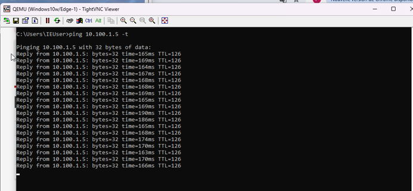
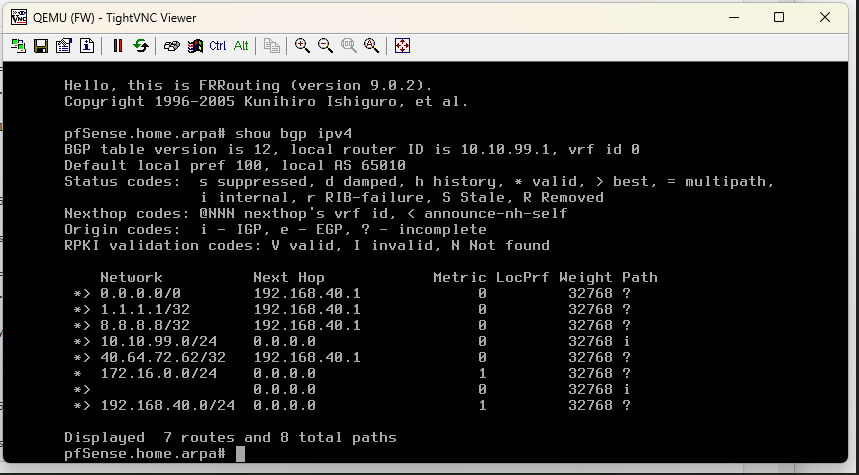
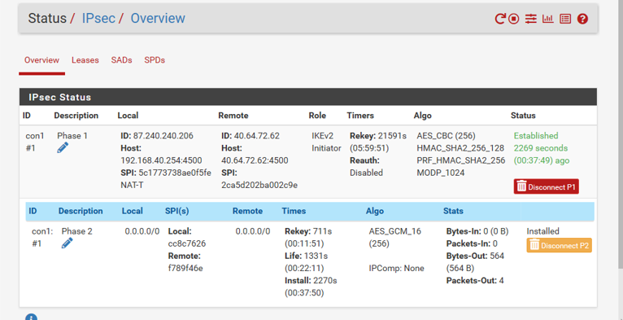

# Azure Hybrid Network Lab  
**BGP over IPsec (IKEv2/VTI) + OSPF (LAN)**

---

## 📌 Overview

This project demonstrates a **hybrid network architecture between Azure and on-premises infrastructure**, using:

- IPsec (IKEv2 / VTI)
- BGP (Azure ↔ pfSense)
- OSPF (LAN routing)
- End-to-end connectivity validation
- Real-world troubleshooting scenario

---

## 🧠 Architecture

  

---

## ⚙️ Technologies Used

- Azure Virtual Network (VNet)
- pfSense (IPsec + FRR BGP)
- FRRouting (BGP / OSPF)
- Windows Server / Client
- Ubuntu Server
- tcpdump (packet analysis)

---

## 🔗 Routing Design

- **BGP** used between Azure and pfSense (dynamic routing over IPsec)
- **OSPF** used internally between pfSense and LAN router
- No static routes between environments

---

## 🔐 IPsec Tunnel

- IKEv2 with VTI
- AES-256 encryption
- SHA256 authentication
- Stable tunnel with continuous traffic flow

---

## 🌐 End-to-End Connectivity

- LAN → Azure VM connectivity validated
- Azure → LAN connectivity validated
- ICMP tests confirm bidirectional communication

---

## 🧪 Troubleshooting Scenario

A real-world issue was identified and resolved during validation:

- ❌ ICMP traffic entering IPsec tunnel
- ❌ No return traffic from Azure
- ⚠️ Root cause: routing propagation issue
- ✅ Fix: corrected route advertisement (BGP ↔ OSPF alignment)

👉 **Deep dive:** [Troubleshooting analysis](troubleshooting/)

---

## 📸 Validation & Proof

End-to-end connectivity and routing validation:

  

  

  

👉 Full lab evidence: [View all screenshots](screenshots/)

---

## 🚀 Key Takeaways

- Dynamic routing is critical in hybrid cloud environments  
- IPsec alone is not enough — routing design must be correct  
- Troubleshooting is a core engineering skill, not optional    

---

## 👤 Author

Hands-on lab focused on **real-world hybrid networking, not theory**.
