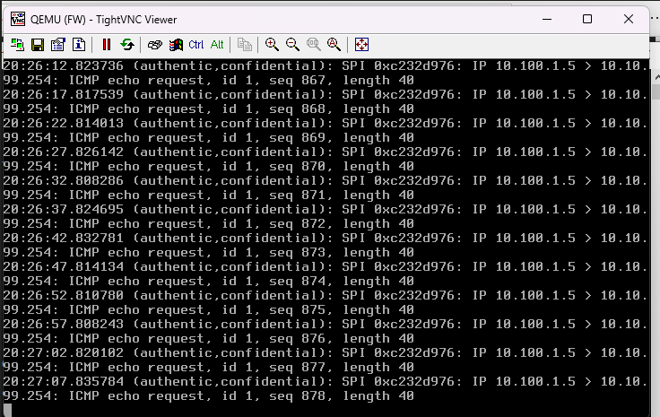

# Issue: No connectivity between LAN and Azure

---

## Symptoms

- ICMP requests failing
- No response from remote network

---

## Evidence

  

  

---

## Analysis

- ICMP traffic observed entering IPsec tunnel
- No return traffic from Azure
- Tunnel established but routing incomplete

---

## Root Cause

Missing or incorrect route propagation between:

- BGP (Azure ↔ pfSense)
- OSPF (pfSense ↔ LAN)

---

## Fix

- Adjusted routing advertisement
- Ensured proper route redistribution between BGP and OSPF

---

## Result

  

✅ End-to-end connectivity restored
